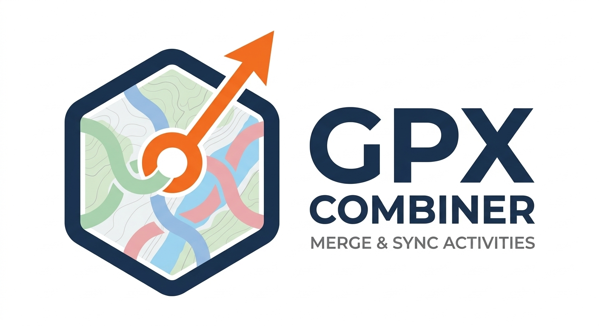

<p align="center">
  
</p>

<h1 align="center">GPX Combiner</h1>

<p align="center">
  A small local desktop app to combine GPX tracks, import activities straight from Strava, and preview them on a map — no cloud, no account, nothing leaves your computer except calls to Strava's own API.
</p>

<p align="center">
  
  
  
</p>

<p align="center">
  <a href="https://github.com/florentchevallier/GPX-Combiner/releases/latest"><strong>⬇ Download the latest release (macOS / Windows)</strong></a>
</p>

---

## Table of contents

- [Download](#download)
- [What it does](#what-it-does)
- [Requirements](#requirements)
- [Installation](#installation)
  - [Option A — Download the app (recommended)](#option-a--download-the-app-recommended)
  - [Option B — Run from source](#option-b--run-from-source)
  - [Optional: drag-and-drop](#optional-drag-and-drop)
- [Connecting Strava](#connecting-strava)
- [Using the app](#using-the-app)
- [Troubleshooting](#troubleshooting)
- [Privacy](#privacy)
- [Packaging as a standalone app yourself](#packaging-as-a-standalone-app-yourself)
- [QGIS plugin](#qgis-plugin)
- [Changelog](#changelog)

## Download

Prebuilt, ready-to-run apps for **macOS** and **Windows** are published on the
[**Releases**](https://github.com/florentchevallier/GPX-Combiner/releases) page — no Python installation needed.

👉 Grab the latest version here: **[github.com/florentchevallier/GPX-Combiner/releases/latest](https://github.com/florentchevallier/GPX-Combiner/releases/latest)**

Download the `.app`/`.dmg` for macOS or the `.exe`/`.zip` for Windows from the **Assets** section of that release. If you'd rather run the Python script directly (any OS, always the latest source), see [Option B](#option-b--run-from-source) below.

🧩 Using QGIS instead? A beta plugin is in the same release's Assets — see [QGIS plugin](#qgis-plugin) below.

> **Unsigned build warning:** these builds aren't signed with a paid Apple/Microsoft developer certificate, so:
> - **macOS:** Gatekeeper will say the app "cannot be opened" the first time — right-click (or Control-click) the app → **Open** → **Open** again in the dialog. You only need to do this once.
> - **Windows:** SmartScreen may show "Windows protected your PC" — click **More info → Run anyway**.

## What it does

- **Combine multiple GPX files** into one, in chronological order — handy for splitting a long ride/run into segments on your GPS device and merging them back into a single activity afterwards.
- **Import activities directly from Strava**: browse your recent activities (with pagination, date filtering, and a choice of 10/25/50 per page), pick the ones you want, and download them as GPX — Strava's API doesn't offer a direct GPX export, so the app rebuilds one from the underlying GPS/altitude/time (and optionally heart rate/cadence/power/temperature) data streams.
- **Preview tracks on a map** before combining: an OpenStreetMap view with each track in its own color, start/finish markers, and a legend.
- **Keep or drop extra sensor data**: each file shows which of HR / cadence / power / temperature it contains, and you can choose which of those to keep in the combined output.
- **Multi-language interface**: French, English, Spanish, German.

## Requirements

- Python 3.9 or later (the app uses only Python's standard library — no dependencies required for the core features).
- Drag-and-drop is optional and needs one small extra package (see below).

## Installation

### Option A — Download the app (recommended)

See [Download](#download) above — grab the prebuilt macOS or Windows app from the [latest release](https://github.com/florentchevallier/GPX-Combiner/releases/latest) and skip straight to [Connecting Strava](#connecting-strava).

### Option B — Run from source

If you don't already have Python, download the latest stable version from
[python.org/downloads/macos](https://www.python.org/downloads/macos/) (macOS) or [python.org/downloads/windows](https://www.python.org/downloads/windows/) (Windows) and install it.

Then, from Terminal (macOS/Linux) or Command Prompt (Windows), run the app with:

```bash
python3 "/path/to/gpx_combiner.py"
```

**On macOS, if that doesn't work**, it's almost always a Tk (the GUI toolkit) issue with a Homebrew-installed Python. Fix it with:

```bash
# Install Homebrew if you don't have it: https://brew.sh

# Install/repair Tk support
brew install python-tk

# Make sure everything is current
brew update
brew upgrade tcl-tk
brew reinstall python-tk@3.13   # replace 3.13 with your own Python version
```

Then confirm Tk works on its own:

```bash
python3 -c "import tkinter; tkinter._test()"
```

A small test window should pop up. If it does, the app itself should now launch normally.

**On Windows or Linux**, the app runs the same way (`python3 gpx_combiner.py`). Tk ships with most Python installers already; if not, install your distro's `python3-tk` package (Linux) or re-run the Python installer with the "tcl/tk" option checked (Windows).

### Optional: drag-and-drop

Dragging GPX files straight into the app window needs the small third-party `tkinterdnd2` package:

```bash
pip3 install tkinterdnd2
```

Without it, the app works exactly the same — you just use the "Add GPX files…" button instead of dragging files in.

## Connecting Strava

Strava requires every app — including one running on your own computer — to be registered with a **Client ID** and **Client Secret** before it can request your data. This is a one-time setup, entirely on Strava's side; nothing is shared with anyone but Strava and your own computer.

1. **Log in to Strava**, then go to your API settings page:
   👉 **https://www.strava.com/settings/api**
   (this is the same as "Settings → My API Application" from your Strava profile menu)

2. **Create an application.** You'll be asked for:
   | Field | What to put |
   |---|---|
   | **Application Name** | Anything you like, e.g. `GPX Combiner` |
   | **Category** | Any category fits — e.g. *Visualizer* |
   | **Club** | Leave blank |
   | **Website** | `http://localhost` (or any URL — Strava requires something here, but it isn't actually used by this app) |
   | **Application Icon** | Strava requires you to upload an image to complete this form. Any square-ish image works — the app's logo [here](https://raw.githubusercontent.com/florentchevallier/GPX-Combiner/refs/heads/main/Art/Logo/Logo_v3_square.png), or even just a placeholder picture. It's only shown on Strava's own site, never inside GPX Combiner. |
   | **Authorization Callback Domain** | **`localhost`** — this one matters. GPX Combiner runs a tiny, temporary local web server on your own computer to receive Strava's authorization response, and Strava will refuse the connection if this field isn't set to exactly `localhost`. |

3. **Save.** Strava will show you a **Client ID** (a short number) and a **Client Secret** (a longer string, hidden behind a "Show" button).

4. **Back in GPX Combiner**, click **"Import from Strava…"** (or **⚙ Strava settings → Connect…**). The first time, it'll ask for these two values — paste them in, and it'll walk you through the rest:
   - Your browser opens Strava's authorization page.
   - Click **Authorize**.
   - You'll see a small "you can close this window" confirmation — switch back to the app, and your activities will load.

Your Client ID/Secret and access tokens are saved **only** in a `strava_config.json` file next to the script on your own computer — never sent anywhere except directly to Strava's API. You can revoke access and erase everything at any time from **⚙ Strava settings → Disconnect and erase credentials**.

> **Troubleshooting the connection?** See the [Troubleshooting](#troubleshooting) section below.

## Using the app

1. **Add tracks** — drag and drop GPX files onto the list, use the **"Add GPX files…"** button, or import them straight from Strava.
2. Files are automatically **sorted chronologically** (by their first timestamp).
3. Click **"Preview…"** to see all loaded tracks overlaid on a map, each in its own color, with start/finish markers.
4. Choose which extra data to keep — **HR / Cadence / Power / Temp** — using the checkboxes above the combine button (only shown if at least one loaded file actually contains that data).
5. Click **"Combine and save…"** and pick where to save the result.

## Troubleshooting

<details>
<summary><strong>The app crashes on launch / "Python quit unexpectedly"</strong></summary>

This is almost always a broken Tcl/Tk install from Homebrew. See the [Run from source](#option-b--run-from-source) steps above — installing/repairing `python-tk` and restarting your Mac fixes this in most cases.
</details>

<details>
<summary><strong>Strava activities won't load / a certificate error appears in Terminal</strong></summary>

This means Python can't verify Strava's SSL certificate.

- **Downloaded app (from Releases):** this shouldn't happen — the app bundles its own trusted certificates (`certifi`). If you still hit this, please [open an issue](https://github.com/florentchevallier/GPX-Combiner/issues).
- **Running from source:** common with the official python.org installer, which doesn't reuse macOS's system certificates. Easiest fix — install `certifi` so the app uses its bundled CA list instead of the system one:
  ```bash
  pip3 install certifi
  ```
  Alternatively (or if that doesn't help), reinstall Python's own certificates:
  ```bash
  python3 --version   # note your version number

  open "/Applications/Python 3.13/Install Certificates.command"   # adjust 3.13 to match
  ```
</details>

<details>
<summary><strong>Strava authorization fails with "Authorization Error" / "Application ... invalid"</strong></summary>

Double-check the **Client ID** and **Client Secret** you entered match exactly what's currently shown on your app's page at strava.com/settings/api (if you ever click "Generate a new client secret" there, the old one stops working immediately). Use **⚙ Strava settings → Disconnect**, then reconnect with fresh values.
</details>

<details>
<summary><strong>The browser opens for Strava authorization, confirms success, but the app never loads anything</strong></summary>

Make sure your Strava application's **Authorization Callback Domain** is set to exactly `localhost` (see step 2 above). This is the single most common misconfiguration.
</details>

## Privacy

- All data stays local: GPX files, Strava credentials, and downloaded activities are only ever written to your own computer.
- The only network calls this app makes are to Strava's official API (`strava.com`) when you explicitly use the Strava import feature, and to OpenStreetMap's tile server when you open the map preview.
- Nothing is sent to any third-party analytics, ad, or tracking service — this app has none.

## Packaging as a standalone app yourself

Want to build your own `.app`/`.exe` instead of using the one from [Releases](https://github.com/florentchevallier/GPX-Combiner/releases)? See `setup.py` (uses [py2app](https://py2app.readthedocs.io/)):

```bash
pip3 install py2app certifi
python3 setup.py py2app -A     # fast "alias" build, for testing
python3 setup.py py2app        # full standalone build, in dist/
```

Note: without an Apple Developer certificate and notarization, macOS Gatekeeper will show a warning the first time you open an unsigned build (right-click → Open bypasses this once).

## QGIS plugin

A companion QGIS plugin lives in [`qgis-plugin/`](qgis-plugin/), sharing its GPX-combining and Strava logic with the desktop app via [`core/`](core/). It lets you load GPX tracks as styled QGIS layers (with an OpenStreetMap basemap and directional arrows), import Strava activities, and combine/export — without leaving QGIS.

**Status: beta, tested on macOS only so far** — the code is platform-independent Python/Qt/QGIS APIs, but Windows/Linux haven't been verified yet.

### Install the beta

The plugin's `.zip` is published alongside the desktop app on the [**v3.6.3 release**](https://github.com/florentchevallier/GPX-Combiner/releases/tag/v3.6.3) (and on [every release](https://github.com/florentchevallier/GPX-Combiner/releases) from here on).

1. Download `gpx_combiner-0.2.0-beta.zip` from that release's **Assets**
2. In QGIS: **Plugins → Manage and Install Plugins → Install from ZIP**, select the downloaded file
3. If it doesn't show up afterward, check "Show also experimental plugins" under **Plugins → Manage and Install Plugins → Settings** — this beta is still flagged experimental

Not yet published to the official QGIS plugin repository (the list QGIS shows automatically without needing a `.zip`) — see the [changelog](CHANGELOG.md) for what's implemented so far, and please [report issues](https://github.com/florentchevallier/GPX-Combiner/issues) you run into, especially on Windows/Linux.

### Developing / running from source

If you'd rather work straight from a repo checkout instead of installing the packaged `.zip`:

```bash
# From this repo, inside qgis-plugin/: link core/ in so it's reachable
# from inside the plugin folder (QGIS only ever sees qgis-plugin/ in isolation)
cd qgis-plugin
ln -s ../core core

# Then symlink the whole qgis-plugin/ folder into your QGIS profile's plugins folder:
#   macOS:   ~/Library/Application Support/QGIS/QGIS3/profiles/default/python/plugins/
#   Windows: %APPDATA%\QGIS\QGIS3\profiles\default\python\plugins\ (needs Developer Mode
#            enabled, or an elevated command prompt, to create symlinks)
#   Linux:   ~/.local/share/QGIS/QGIS3/profiles/default/python/plugins/
ln -s "$(pwd)" "<profile plugins folder>/gpx_combiner"
```

Then enable "GPX Combiner" the same way as above. To build your own `.zip` from source instead (e.g. after making changes), see [`build_plugin_zip.py`](build_plugin_zip.py) — it stages a clean copy (physically bundling `core/`, no symlinks or dev cruft) into `dist/`.

## Changelog

See [`CHANGELOG.md`](CHANGELOG.md) for the full version history of both the desktop app and the QGIS plugin.

---

<p align="center"><sub>Version 3.6.3</sub></p>
